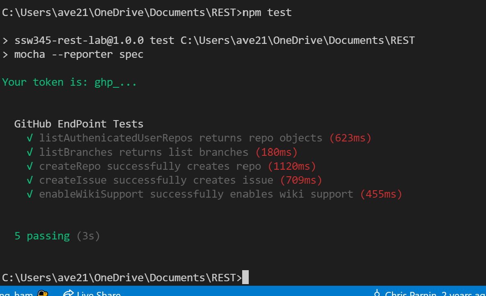
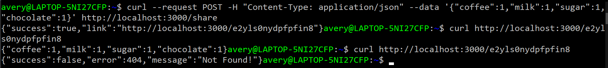

# HW3 - REST APIs

## Part 1: REST Client
In this section several simple functions were created to allow a user to interact with the GitHub API to create and modify repositories

## Part 2: REST Server
In this section a REST server was run to allow for the temporary storage and retrieval of JSON objects
